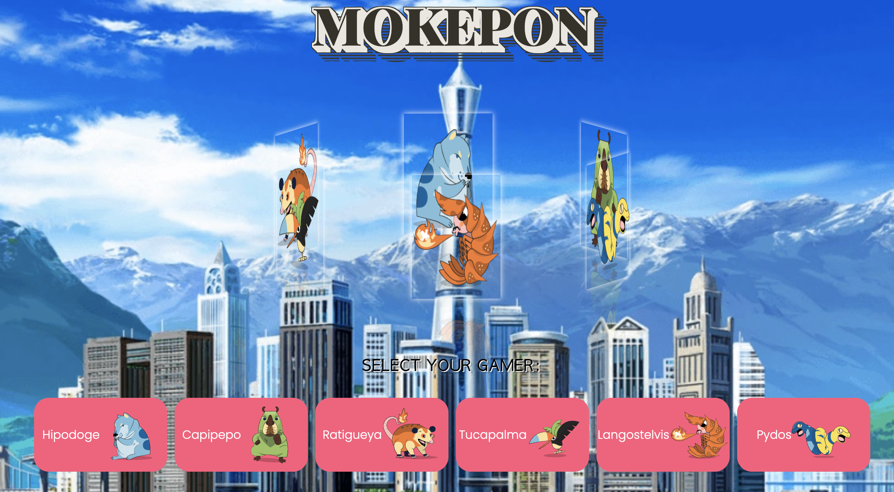

# Mokepon Game


## Introduction

Welcome to the Rudimentary Gaming Web Application! 
This project is a simple yet engaging gaming experience created using a combination of HTML, CSS, and JavaScript. It's complemented by Express.js, which serves as the web server. 
In this web application, users have the opportunity to select a combatant with a unique set of five distinct abilities and engage in exciting confrontations with their adversaries.

In this README, you will find information about the project, how to run it, and other relevant details.

## Table of Contents

1. [Features](#features)
2. [Technologies Used](#technologies-used)
3. [Prerequisites](#prerequisites)
4. [Getting Started](#getting-started)
5. [Usage](#usage)
6. [Contributing](#contributing)
7. [Credits](#credits)

## Features

- Interactive Gaming: Engage in thrilling battles with water,fire or earth combatants.
- Responsive Design: Play the game on various devices, thanks to the responsive design
- Real-time Updates: Experience real-time game updates and combat status.
  
## Technologies Used

This web application leverages the following technologies:

- **HTML**: For structuring the web page and user interface.
- **CSS**: For styling and ensuring an appealing visual experience.
- **JavaScript**: For adding interactivity and game logic.
- **Express.js**: As the web server framework for serving the application.
 
## Prerequisites

Before you begin, ensure you have met the following requirements:

- [Node.js](https://nodejs.org/) installed on your system.
- Familiarity with web development tools and concepts.
  
## Getting Started

To get started with this gaming web application, follow these steps:

1. Clone the repository to your local machine:

   ```bash
   git clone https://github.com/kathylangarano/mokepongame.git
   ```

2. Change to the project directory:

   ```bash
   cd mokepongame
   ```

3. Start the development server:

   ```bash
   node index.js
   ```

4. Open your web browser and navigate to `http://localhost:3000` to access the application.
   
Make sure that you installed the necessary dependencies

## Usage

1. Once you navigate to `http://localhost:3000` to access the application, open another window to start the other player.
2. Upon accessing the application, you will be presented with the main game screen.
3. Choose your combatant in both windows.
4. Participate in the battle with the opponent by meeting the other player on the battlefield (they have to be together to start the fight).
5. Select five abilities from the available options.
6. Monitor the real-time updates on the game screen to track your progress.

## Contributing
If you would like to contribute to this project, please follow these guidelines:

1. Fork the repository on GitHub.
2. Create a new branch with a descriptive name.
3. Make your changes and ensure the code is well-documented.
4. Test your changes thoroughly.
5. Create a pull request to the main repository's main branch.

We appreciate your contributions!

## Credits
This project is based on the basic programming course by [Platzi]([https://github.com/platzi]).

Thank you for using the Mokepon Gaming Web Application! We hope you enjoy the gaming experience and welcome your feedback and contributions to make it even better.
